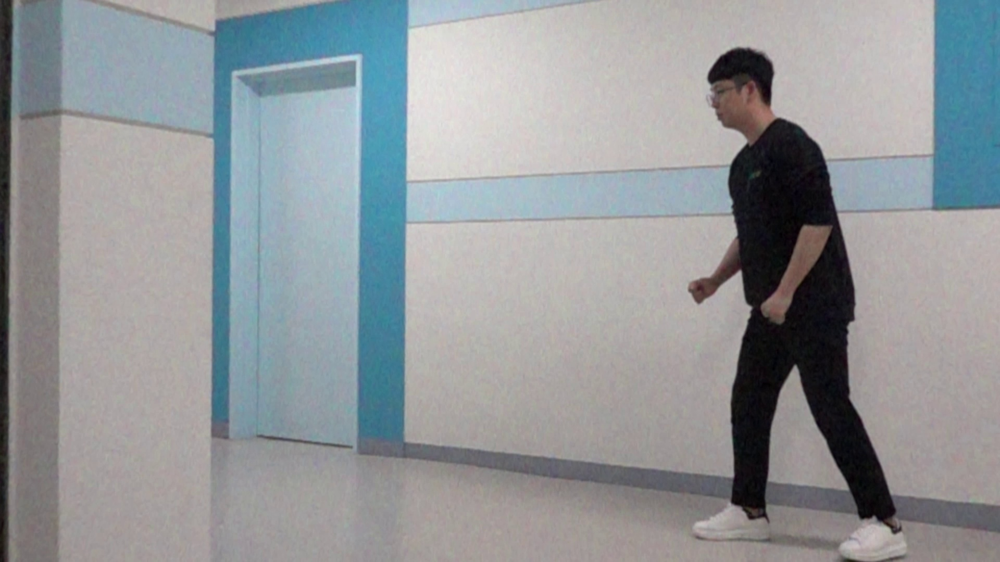
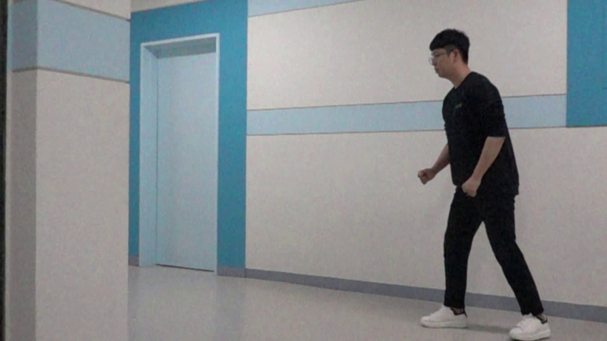
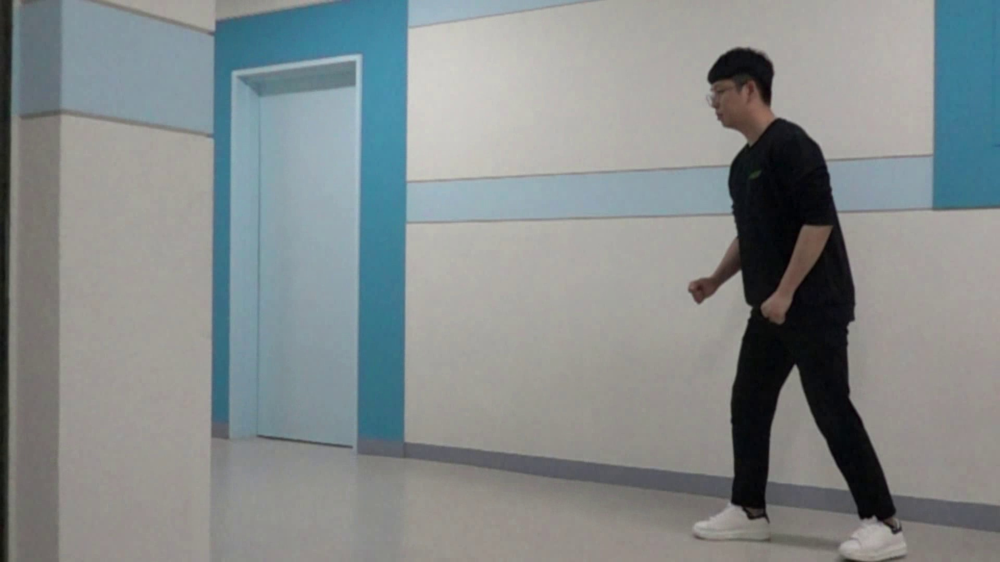

# Abstract
High-speed images are affected by serious noise and illumination distortion by flickers of artificial lighting. Thus, in this repo, we suggest effective flicker noise removal method for high-speed images. First, measure flicker cycle using fourier transform from the variation in the light intensity of the frames. Then, calibrate the frames to luminance invariant frames based on linear regression model. Finally, blend connected frames considering weights of standard normal distribution to restore flicker affected images.

## Defendency
```
pip install -r requirements.txt
```

## Run
```
python main.py -v "./video/C0183.MP4" -i "./interim" -o "./output"
```

## Test Video
<b>Original Video</b><br>
</img><p>
<b>Interim Video (Luminance Invariant Restoration)</b><br>
</img><p>
<b>Output Video</b><br>
</img><p>

## Image comparison
### Original Video
</img><p>
### Interim Video (Apply Luminance Smoothing)
</img><p>
### Output Video (Apply Noise Rejection Method)
</img><p>
  
## Zoomed Images
### Original / Interim / Output Video
</img></img></img><p>
